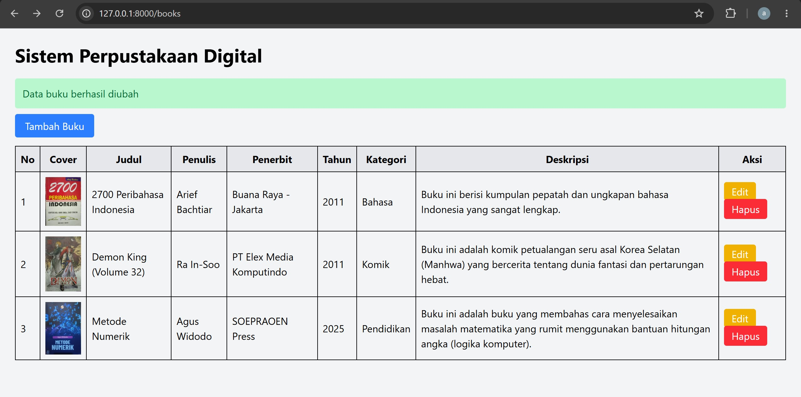
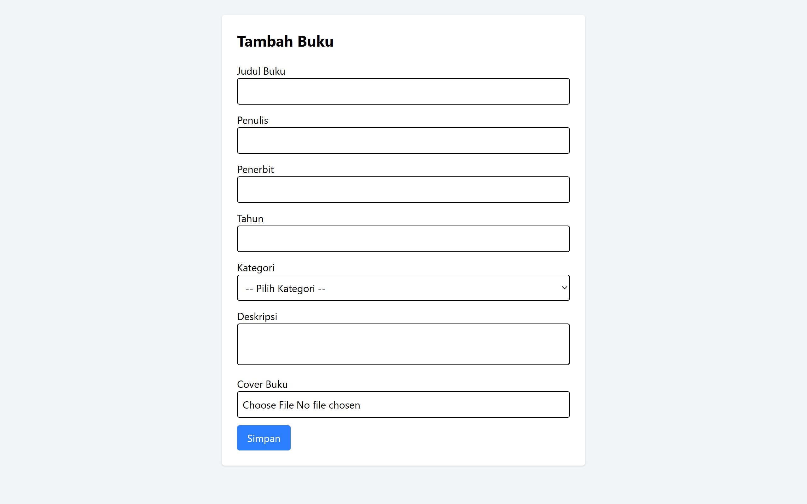
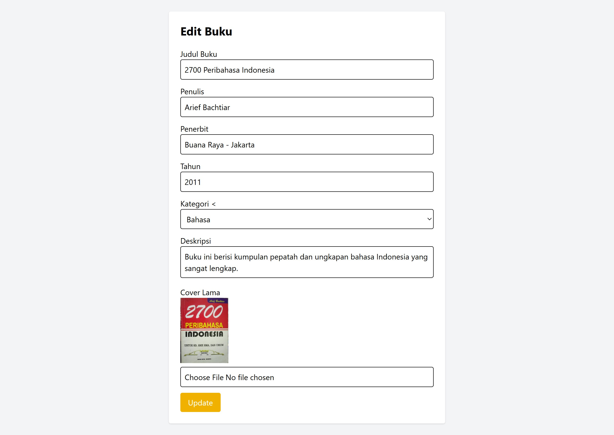
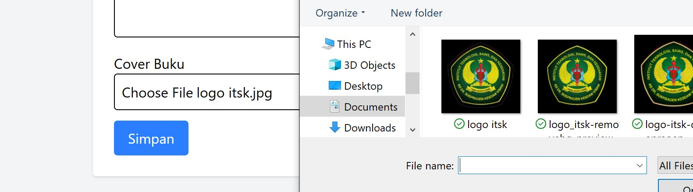
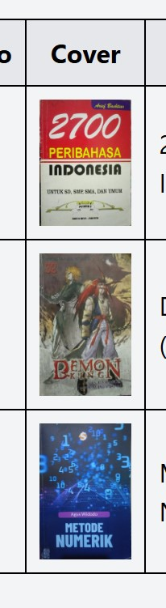
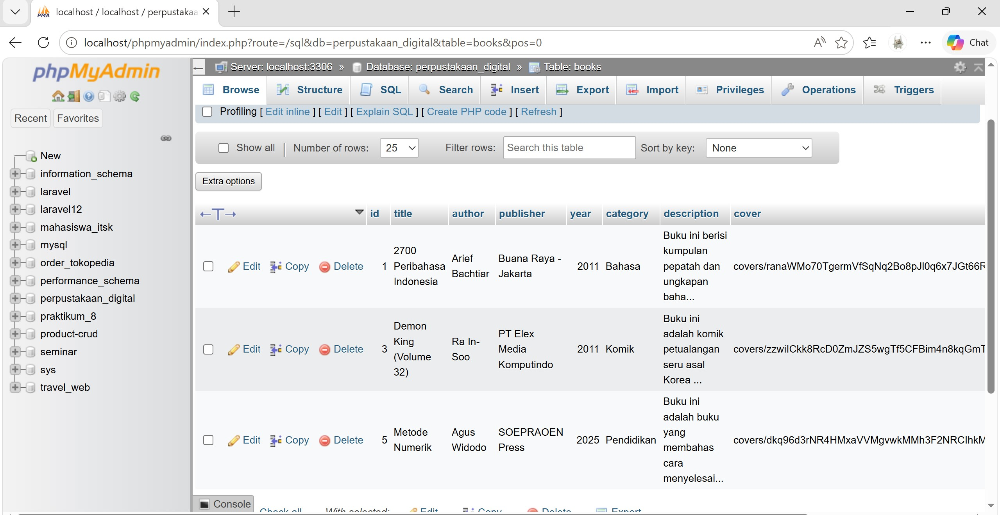

# Perpustakaan Digital Laravel

## Deskripsi
Project ini merupakan aplikasi CRUD Perpustakaan Digital menggunakan Laravel Framework dengan konsep MVC.

## Fitur
- Menampilkan data buku
- Menambahkan data buku
- Mengubah data buku
- Menghapus data buku
- Validasi form
- Upload cover buku
- Responsive menggunakan Tailwind CSS

## Screenshot 
### Halaman Utama

### Tambah Data Buku

### Edit Data Buku

### Upload Cover Buku

### Database

